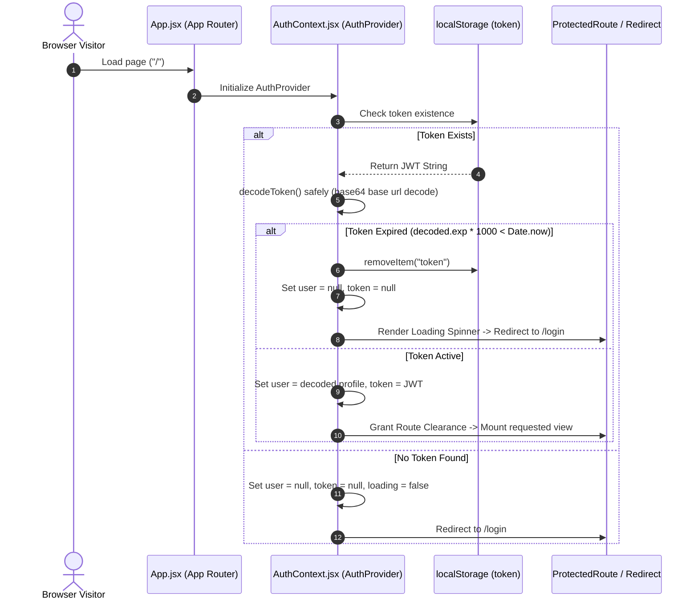
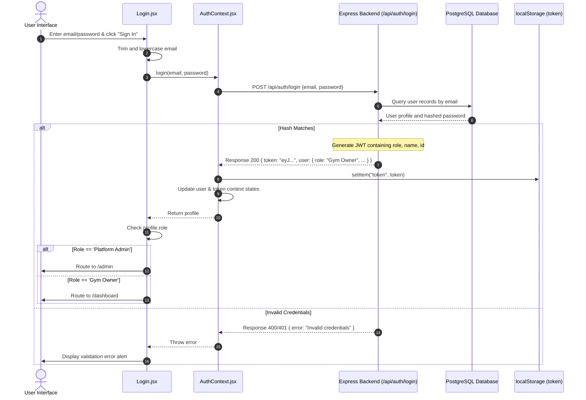
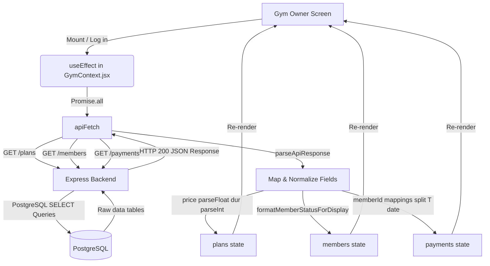
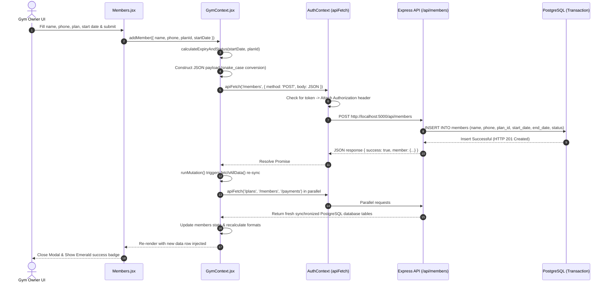
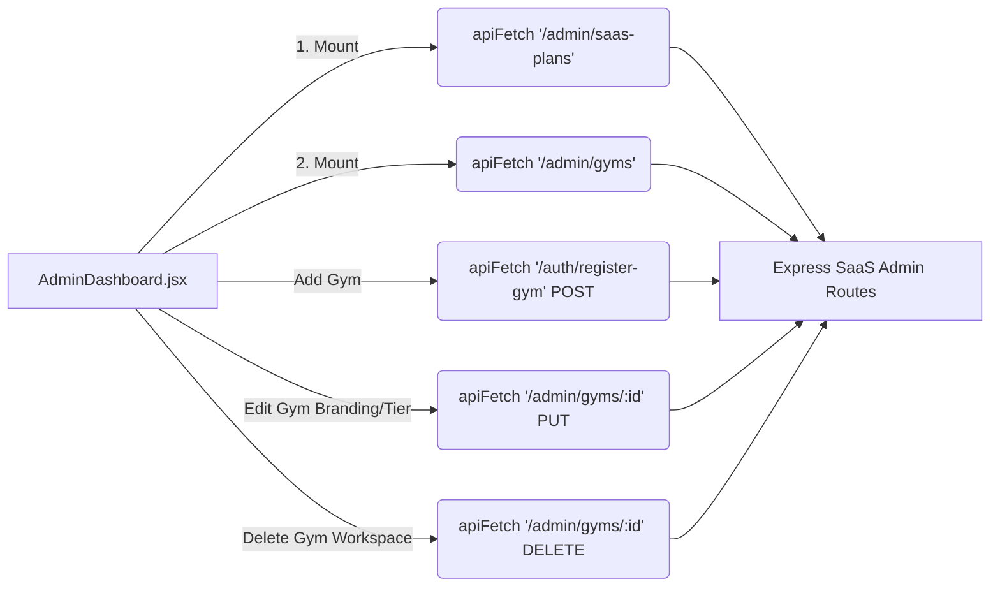

# VibeSaaS Frontend Architecture & Request Flows

This documentation provides an in-depth, flow-based analysis of the VibeSaaS frontend codebase located in `vibe-frontend`. It details the path of requests starting from visual user interactions in the browser, traversing through React contexts and global state layers, navigating the customized interceptors, and hitting the backend API.

---

## 📂 Architecture Overview

The frontend is built on **Vite**, **React 18**, and **React Router v6**. It features a modern decoupled architecture that separates the user interface from business state logic, token management, and data synchronization:

```
src/
├── main.jsx                 # Application bootstrapping and React DOM rendering
├── App.jsx                  # Central routing table, role-based guard policies, and layout mappings
├── App.css                  # Modern glassmorphic style specifications
├── index.css                # Base Tailwind/utility configurations
│
├── context/                 # STATE MANAGEMENT & BACKEND WORKERS
│   ├── AuthContext.jsx      # Session state, JWT parser, and global fetch client (apiFetch)
│   └── GymContext.jsx       # Tenant database worker; manages plans, members, and payment state
│
├── layouts/                 # STRUCTURAL SHELLS
│   └── OwnerLayout.jsx      # Dashboard shell featuring sidebars, mobile submenus, and router Outlets
│
├── pages/                   # VIEWS & SCREEN CONTROLLERS
│   ├── admin/
│   │   ├── AdminDashboard.jsx    # SaaS platform tenant creation and workspace management
│   │   └── AdminSaasPlans.jsx    # SaaS billing tiers management
│   ├── auth/
│   │   └── Login.jsx             # Secure entrance screen with local dev-sandbox guards
│   └── owner/
│       ├── OwnerDashboard.jsx    # Visual overview with aggregated KPI metrics
│       ├── Members.jsx           # Member directory directory with pagination/forms
│       ├── Plans.jsx             # Membership plans catalog builder
│       └── Payments.jsx          # Transaction register and checkout receipt records
│
└── utils/                   # STATIC DOMAIN SCHEMAS & HELPERS
    ├── api.js               # Clean response parser for defensive error reporting
    ├── roles.js             # Canonical SaaS roles (PLATFORM_ADMIN, GYM_OWNER)
    └── memberStatus.js      # Membership calculation and display formatting helpers
```

---

## ⚡ Core Network & Request Foundations

At the heart of the system is the dynamic token worker configured in [AuthContext.jsx](file:///home/daniel/vibe-frontend/src/context/AuthContext.jsx). Rather than manually configuring `fetch` on every component, all communication flows through a unified request pipelines builder.

### 1. Unified Fetch Interceptor (`apiFetch`)
`apiFetch` acts as an HTTP client interceptor. It:
- **Secures Requests:** Injects `Authorization: Bearer <token>` dynamically if a session exists in context state or local storage.
- **Smart Headers:** Detects if the payload (`body`) is an instance of `FormData`. If it is NOT, it automatically injects `Content-Type: application/json`. If it IS, it leaves the Content-Type blank, allowing the browser to set boundaries for multi-part file streaming.
- **Defensive Session Protection:** Automatically catches `401 Unauthorized` responses from the backend, triggers an immediate `logout()` to purge corrupted tokens, and forces React Router to bounce the visitor back to `/login`.

### 2. Defensive JSON Parser (`parseApiResponse`)
Defined in [api.js](file:///home/daniel/vibe-frontend/src/utils/api.js), this utility wraps response parsing to defend against backend crashes (e.g., when Express crashes and returns standard HTML stack traces, or when database queries fail with plain text):
- If the response is blank, it returns `{}`.
- If JSON parsing fails, it extracts an 80-character snippet of the raw response text, raises an error highlighting the status code, and reminds developers to ensure the backend server is running (`cd vibe && npm start`).

---

## 🗺️ Flow 1: Session Rehydration & Initialization

When a user visits the application or refreshes their browser, the following pipeline executes to restore their state or reject invalid/expired credentials:



### Request Pipeline Tracing
1. **Component Trigger:** [App.jsx](file:///home/daniel/vibe-frontend/src/App.jsx) boots, mounting `<AuthProvider>`.
2. **Context Setup:** `AuthProvider` initializes state:
   ```javascript
   const [token, setToken] = useState(localStorage.getItem('token') || null);
   ```
3. **Execution Hook:** `useEffect` fires in `AuthContext.jsx` lines 41-60.
4. **Token Validation:** `decodeToken()` in `AuthContext.jsx` parses JWT segments. If expiration bounds checks fail, it invokes `logout()`.

---

## 🔑 Flow 2: Authentication & Entrance Login

The process that executes when a user types in their email and password and hits "Sign In":



### Request Pipeline Tracing
1. **Source:** `handleSubmit` inside [Login.jsx](file:///home/daniel/vibe-frontend/src/pages/auth/Login.jsx#L15-L35).
2. **State Invocation:** Invokes `login(email, password)` from `useAuth()`.
3. **HTTP Dispatch:** `login` in `AuthContext.jsx` calls `fetch('http://localhost:5000/api/auth/login', { method: 'POST', ... })`.
4. **Storage & State Capture:** On successful resolve, the JWT is saved, and state redirects via `useNavigate()` based on user role utility checks in [roles.js](file:///home/daniel/vibe-frontend/src/utils/roles.js).

---

## 🏋️ Flow 3: Gym Owner Operations (Plans, Members, Payments)

When a Gym Owner logs in, they are redirected to `/dashboard` wrapping a localized `<GymProvider>` state machine defined in [GymContext.jsx](file:///home/daniel/vibe-frontend/src/context/GymContext.jsx). This provider synchronizes members, plans, and payments dynamically.



### Dynamic Membership Logic (Expiry & Status Calculation)
Whenever a member is added or updated on the frontend, the client-side context does NOT trust the user to calculate the membership duration. It executes **`calculateExpiryAndStatus()`** in [GymContext.jsx](file:///home/daniel/vibe-frontend/src/context/GymContext.jsx#L80-L100):
1. Finds the duration of the selected plan from the synchronized `plans` state.
2. Creates a date object from the user's selected `startDate`.
3. Adds the plan's duration (in months) to the start date to compute `endDate`.
4. Compares `endDate` against `today` to determine their category status:
   - If `diffDays < 0`: Status becomes `expired`.
   - If `diffDays <= 3`: Status becomes `due soon`.
   - Otherwise: Status is `active`.

---

## 🔄 Flow 4: Gym Owner Mutation Pipeline (e.g., Adding a Member)

When a Gym Owner fills out the "Register New Member" form and clicks "Register Member":



---

## 🏢 Flow 5: Platform Admin Operations (Multi-Tenant Management)

Platform Admins bypass normal gym boundaries to operate at the SaaS root level. When accessing `/admin`, [AdminDashboard.jsx](file:///home/daniel/vibe-frontend/src/pages/admin/AdminDashboard.jsx) communicates directly with backend administrative routes:



---

## 📇 API Endpoint Reference Matrix

This reference maps every frontend network trigger to the corresponding backend route, controller scope, and request properties. All paths are relative to `http://localhost:5000/api`.

| Feature Area | Visual Interface / Source file | HTTP Method | API Endpoint | Auth Required | Payload (JSON Body) | Backend Action / Effect |
| :--- | :--- | :---: | :--- | :---: | :--- | :--- |
| **Auth** | [Login.jsx](file:///home/daniel/vibe-frontend/src/pages/auth/Login.jsx) | `POST` | `/auth/login` | No | `{ email, password }` | Authenticates user; returns dynamic JWT containing user profile + expiry. |
| **Plans** | [Plans.jsx](file:///home/daniel/vibe-frontend/src/pages/owner/Plans.jsx) | `GET` | `/plans` | **Yes** | *None* | Retrieves all membership plans for the logged-in owner's tenant. |
| **Plans** | [Plans.jsx](file:///home/daniel/vibe-frontend/src/pages/owner/Plans.jsx) | `POST` | `/plans` | **Yes** | `{ name, duration, price }` | Creates a new membership plan. |
| **Plans** | [Plans.jsx](file:///home/daniel/vibe-frontend/src/pages/owner/Plans.jsx) | `PUT` | `/plans/:id` | **Yes** | `{ name, duration, price }` | Updates plan configuration. |
| **Plans** | [Plans.jsx](file:///home/daniel/vibe-frontend/src/pages/owner/Plans.jsx) | `DELETE`| `/plans/:id` | **Yes** | *None* | Deletes the configured membership plan. |
| **Members**| [Members.jsx](file:///home/daniel/vibe-frontend/src/pages/owner/Members.jsx) | `GET` | `/members` | **Yes** | *None* | Retrieves all registered members for this gym workspace. |
| **Members**| [Members.jsx](file:///home/daniel/vibe-frontend/src/pages/owner/Members.jsx) | `POST` | `/members` | **Yes** | `{ name, phone, plan_id, start_date, end_date, status }` | Registers a new member to the gym. |
| **Members**| [Members.jsx](file:///home/daniel/vibe-frontend/src/pages/owner/Members.jsx) | `PUT` | `/members/:id` | **Yes** | `{ name, phone, plan_id, start_date, end_date, status }` | Updates member details, start date, and status. |
| **Members**| [Members.jsx](file:///home/daniel/vibe-frontend/src/pages/owner/Members.jsx) | `DELETE`| `/members/:id` | **Yes** | *None* | Deletes a member profile. |
| **Payments**| [Payments.jsx](file:///home/daniel/vibe-frontend/src/pages/owner/Payments.jsx) | `GET` | `/payments` | **Yes** | *None* | Retrieves billing transactions ledger. |
| **Payments**| [Payments.jsx](file:///home/daniel/vibe-frontend/src/pages/owner/Payments.jsx) | `POST` | `/payments` | **Yes** | `{ member_id, amount, date, method }` | Records a new cash/card subscription payment receipt. |
| **Payments**| [Payments.jsx](file:///home/daniel/vibe-frontend/src/pages/owner/Payments.jsx) | `DELETE`| `/payments/:id` | **Yes** | *None* | Deletes a transaction receipt records entry. |
| **SaaS Adm**| [AdminDashboard.jsx](file:///home/daniel/vibe-frontend/src/pages/admin/AdminDashboard.jsx) | `GET` | `/admin/saas-plans` | **Yes** (Admin) | *None* | Fetches platform SaaS subscription tier templates. |
| **SaaS Adm**| [AdminDashboard.jsx](file:///home/daniel/vibe-frontend/src/pages/admin/AdminDashboard.jsx) | `GET` | `/admin/gyms` | **Yes** (Admin) | *None* | Fetches list of all gym workspaces (multi-tenancy root view). |
| **SaaS Adm**| [AdminDashboard.jsx](file:///home/daniel/vibe-frontend/src/pages/admin/AdminDashboard.jsx) | `GET` | `/admin/gyms/:id` | **Yes** (Admin) | *None* | Fetches details for a specific gym workspace. |
| **SaaS Adm**| [AdminDashboard.jsx](file:///home/daniel/vibe-frontend/src/pages/admin/AdminDashboard.jsx) | `PUT` | `/admin/gyms/:id` | **Yes** (Admin) | `{ name, saasPlanId, status, stripeCustomerId }` | Updates a gym workspace billing tier, branding, or status. |
| **SaaS Adm**| [AdminDashboard.jsx](file:///home/daniel/vibe-frontend/src/pages/admin/AdminDashboard.jsx) | `DELETE`| `/admin/gyms/:id` | **Yes** (Admin) | *None* | Purges a gym tenant profile from SaaS database. |
| **SaaS Adm**| [AdminDashboard.jsx](file:///home/daniel/vibe-frontend/src/pages/admin/AdminDashboard.jsx) | `POST` | `/auth/register-gym` | **Yes** (Admin) | `{ gymName, email, password, name }` | Deploys a new tenant workspace and provisions a Gym Owner credential. |

---

## 📈 Request Walkthrough: A Deep Code-Level Trace

To understand exactly how code blocks fit together, let's walk through the detailed path a request takes when a Gym Owner **deletes a plan** (e.g. standard monthly tier) in the UI.

### Step 1: The UI Trigger
On [Plans.jsx](file:///home/daniel/vibe-frontend/src/pages/owner/Plans.jsx), a Gym Owner clicks the "Delete" icon adjacent to a Plan row.
- Inside `Plans.jsx`, this executes `handleDeletePlan(id, planName)`:
  ```javascript
  const handleDeletePlan = async (id, name) => {
    if (!window.confirm(`Are you sure you want to remove ${name}?`)) return;
    await deletePlan(id);
  };
  ```
- `deletePlan` is pulled straight from the global Gym context using `useGym()`.

### Step 2: The Context Worker Pipeline
The request enters `deletePlan(id)` inside [GymContext.jsx](file:///home/daniel/vibe-frontend/src/context/GymContext.jsx#L137-L138):
- `deletePlan` invokes `runMutation()` with an anonymous arrow function returning the API call:
  ```javascript
  const deletePlan = async (id) =>
    runMutation(() => apiFetch(`/plans/${id}`, { method: 'DELETE' }));
  ```
- **`runMutation` Execution:**
  ```javascript
  const runMutation = async (request) => {
    const res = await request(); // Executes the apiFetch call
    const data = await parseApiResponse(res);
    if (!res.ok) {
      throw new Error(data.error || `Request failed (${res.status})`);
    }
    await fetchAllData(); // Core Cache Invalidation & Re-sync
    return data;
  };
  ```

### Step 3: The HTTP Client Interceptor
`apiFetch` executes in [AuthContext.jsx](file:///home/daniel/vibe-frontend/src/context/AuthContext.jsx#L89-L122):
- Checks the `localStorage` token and appends headers:
  ```javascript
  const headers = { ...options.headers };
  if (!(options.body instanceof FormData)) {
    headers['Content-Type'] = 'application/json';
  }
  if (token) {
    headers['Authorization'] = `Bearer ${token}`;
  }
  ```
- Performs a standard `window.fetch` to `http://localhost:5000/api/plans/<id>` with method `DELETE`.

### Step 4: The Database Re-synchronization (Cache Invalidation)
Once the backend completes the delete statement and returns `HTTP 200 OK`, `runMutation()` immediately calls **`fetchAllData()`**:
- `fetchAllData()` triggers parallel fetch promises to reload plans, members, and payment rows:
  ```javascript
  const [plansRes, membersRes, paymentsRes] = await Promise.all([
    apiFetch('/plans'),
    apiFetch('/members'),
    apiFetch('/payments')
  ]);
  ```
- The returned data arrays are sanitized, mapped, and updated in the React states (`setPlans`, `setMembers`, `setPayments`).
- The update in context states causes all consuming screens to re-render, reflecting the deleted plan across the system in real time.
